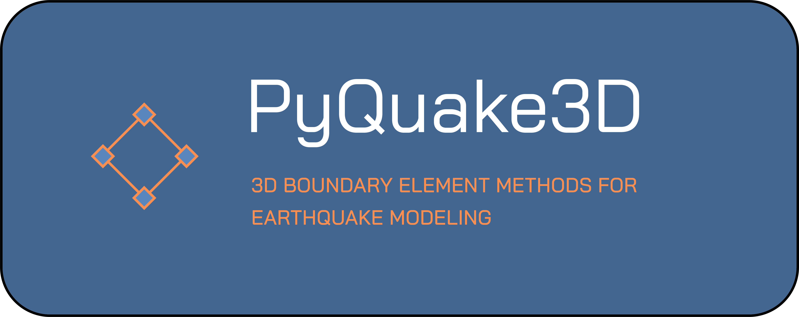

# PyQuake3D_MPI


PyQuake3D is a Python-based Boundary Element Method (BEM) code for simulating sequences of seismic and aseismic slip (SEAS) on a complex 3D fault geometry governed by rate- and state-dependent friction. This document provides an overview of how to use the script, as well as a detailed description of the input parameters.

Please refer to [Code Manual (PDF)](doc.pdf) for more details.

## 🔧 Features

-  3D non-planar quasi-dynamic earthquake cycle simulations
-  Support for rate-and-state aging friction laws
-  Support for Hierarchical matrix storage and calculation
-  MPI acceleration support 
-  Suitable for large model earthquake cycle simulation

## 📦 Installation
-  requirement of python library
-  python>=3.8
-  numpy>=1.2
-  cupy=10.6.0
-  matplotlib==3.2.2
-  scipy==1.10.1
-  joblib==0.16.0
-  mpi4py==4.0.0
  
  Use pip for the quick installation:
```bash
pip install -r requirements.txt
```
  

## Running the Script

To run the PyQuake3D script, use the following command:
```bash
mpirun -np 10 python -g --inputgeo <input_geometry_file> -p --inputpara <input_parameter_file>
```
Where 10 is the number of virtual cpus. Note that using the mpiexec instead in Windows environment.

For example:
```
To execute benchmarks like BP5-QD, use:
```bash
mpirun -np 10 python src/main.py -g examples/cascadia/cascadia35km_ele4.msh -p examples/cascadia/parameter.txt
```
Ensure you modify the input parameter (`parameter.txt`) as follows:
- `Corefunc directory`: `bp5t_core`
- `InputHetoparamter`: `True`
- `Inputparamter file`: `bp5tparam.dat`

📧 Contact

For questions, suggestions, or collaboration, please contact:

📫 Email: 
rongjiang.igp@hotmail.com

luca.dalzilio@ntu.edu.sg

## Videos
[Videos of 2023, Turkey earthquake sequence simulation](https://github.com/Rongjiang007/PyQuake3D/issues/1#issue-2984332698)

[Videos of Earthquake cycle modeling of the Cascadia subduction zone](https://github.com/Rongjiang007/PyQuake3D/issues/2#issue)

[Videos of Numerical simulation of main shock and aftershock](https://github.com/Rongjiang007/PyQuake3D/issues/3#issue)


